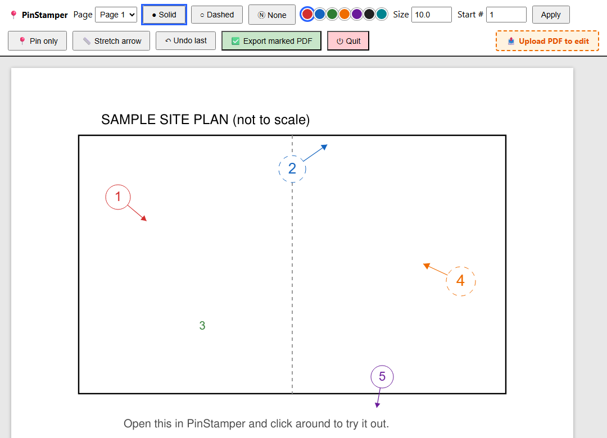

# PinStamper

A tiny local web tool for stamping numbered pins + direction arrows onto any
PDF — by hand, one click at a time. Built for annotating plan drawings
(site plans, floor plans, inspection photo-location diagrams, punch lists —
anything where you need to say "photo/item #7 is right here, facing that
way") without a heavyweight CAD or PDF-editing suite.

No auto-detection, no AI, no cloud — it's a precise, deliberate clicking
tool that runs entirely on your machine.



## The idea

Marking up a plan usually isn't slow because of the marking — it's the
repetition. In most PDF tools, every single point means: select the circle
tool, draw a circle, switch to the text tool, type a number, switch to the
arrow tool, drag a line — then do it all again for the next point. Even
professional tools that get close (Bluebeam Revu's "Sequences" feature can
auto-increment a markup's number) still require you to manually set up that
numbering sequence first, and still place the shape and its arrow as
separate steps. Construction punch-list apps (Punchly, OpenSpace, and
similar) do drop numbered pins on a plan, but they're cloud/mobile products,
and placing a pin and aiming a direction arrow are still two disconnected
actions rather than one gesture.

PinStamper's whole design is built around collapsing that into a single
loop: **click** to drop a pin, **move the mouse** to aim its arrow, **click**
again to confirm — and the next number is already active, no reselecting
anything. Marking up a page of dozens of points becomes one continuous
motion instead of a string of tool switches, entirely free and running
locally, with no account, no setup, and no per-seat license.

## Why

Most "add a comment to a PDF" tools either flatten your markup into the page
(so it can never be edited again) or require a full desktop PDF editor.
PinStamper does neither:

- **Non-destructive while you work.** The source PDF is never touched. Every
  pin lives in a sidecar `<name>.pinstamp.json` next to it, autosaved on every
  change — close the tab, reopen the same PDF later, and you're exactly
  where you left off, like a project file.
- **Real, editable PDF output.** "Export marked PDF" writes each pin as a
  genuine PDF annotation (Circle / Line / Polygon / FreeText) — not
  rasterized or flattened content. Anyone opening the exported file in Adobe
  Acrobat/Reader (no PinStamper install needed) can select, move, recolor, or
  delete a mark afterward, the same as any PDF comment.
- **Per-pin style.** Each pin has its own color (from a small built-in
  palette), size, and border style (solid/dashed/no circle at all), and an
  optional direction arrow whose angle and length can be re-aimed at any
  time after placement — no need to delete and redo it.

## Requirements

- Python 3.9+
- [PyMuPDF](https://pymupdf.readthedocs.io/) (`pip install -r requirements.txt`)
- Any modern browser (Chrome, Edge, Firefox) — the UI runs there, not in a
  desktop window

## Quick start

```bash
pip install -r requirements.txt
python -m pinstamp.core path/to/plan.pdf
```

This opens your default browser to a local page (`http://127.0.0.1:8766`)
with the PDF loaded. Try it immediately on the bundled sample:

```bash
python -m pinstamp.core sample/sample-plan.pdf
```

Extra flags:

```bash
python -m pinstamp.core plan.pdf --port 9000     # use a different port
python -m pinstamp.core plan.pdf --no-browser    # don't auto-open a browser tab
```

### Using it

- **Click** on the drawing to drop a numbered pin, then **move the mouse** to
  aim its arrow, then **click again** to fix the direction and advance to the
  next number.
- **Right-click** cancels a pin placement that's in progress.
- **Pin only** — toggle this to place a bare numbered pin with a single
  click, no arrow at all.
- **Stretch arrow** — toggle this to make the second click's distance set the
  arrow's length, instead of using the fixed default.
- **Color / Size / Solid–Dashed–None** — pick before placing new pins, or change
  any already-placed pin from the list below the canvas at any time.
- **↻ aim** (per pin, in the list) — re-aim or add an arrow to a pin you
  already placed: click it, move the mouse, click the canvas to confirm.
- **⊘** removes a pin's arrow; **✕** deletes the pin entirely.
- **📤 Upload PDF to edit** — the bold button in the top-right of the
  toolbar opens a native "Open PDF" dialog and switches to marking up that
  file in place, without restarting the tool. (It opens the real file where
  it already lives, rather than copying it somewhere new.)
- **Export marked PDF** writes `<name>_marked.pdf` next to your source file.
  Exporting never overwrites a previous export — repeated exports get
  `_marked_v2.pdf`, `_marked_v3.pdf`, and so on.
- **⏻ Quit** shuts down the local server from the page itself — handy since
  the packaged exe has no console to Ctrl+C.

### Autosave and closing

Every change is saved to the sidecar `.pinstamp.json` file within a fraction
of a second — there's no explicit "save" step. The local server also watches
for the browser tab: if it doesn't hear from the page for ~15 seconds (e.g.
you closed the tab), it shuts itself down automatically so you don't end up
with an orphaned background process. Simply run the command again (or
double-click the exe) to resume.

## Packaging as a standalone .exe (Windows)

No Python install needed for end users — just a double-click launcher with a
native "Open PDF" file picker.

```bash
build.bat
```

Produces `dist/PinStamper.exe` (via PyInstaller; onefile, ~50MB). First run
may be flagged by Windows SmartScreen since the exe isn't code-signed —
click "More info" → "Run anyway".

## How it works

- `pinstamp/core.py` — a stdlib `http.server` bound to `127.0.0.1` only, plus
  [PyMuPDF](https://pymupdf.readthedocs.io/) for page rendering and PDF
  annotation writing. The browser page is a single HTML/JS file served
  in-memory; a `<canvas>` overlay handles the live click-to-place interaction
  against a rendered PNG of the current page.
- `gui.py` — a minimal tkinter launcher (file-picker → starts the server →
  opens the browser) for the packaged exe.
- Nothing leaves your machine. There's no network call other than the local
  server your own browser talks to.

## Customizing the palette

Colors live in a single list near the top of `pinstamp/core.py`:

```python
PALETTE = [
    ("Red", "#d32f2f"),
    ("Blue", "#1565c0"),
    ("Green", "#2e7d32"),
    ("Orange", "#ef6c00"),
    ("Purple", "#6a1b9a"),
    ("Black", "#212121"),
    ("Teal", "#00838f"),
]
```

Edit, add, or remove entries to match your own house style — the browser UI
and the exported PDF colors both read from this one list.

## Troubleshooting

- **Page won't load / connection refused** — the server auto-shuts-down
  after ~15-35s if no browser tab ever connects to it (see
  [Autosave and closing](#autosave-and-closing)). Just rerun the command; if
  it still doesn't open, browse to the printed URL
  (`http://127.0.0.1:8766/`) manually.
- **Port already in use** — pass `--port <n>` to pick a different one, or
  just rerun; `serve()` automatically scans the next 20 ports for a free one.
- **SmartScreen warning on the exe** — expected for an unsigned binary;
  click "More info" → "Run anyway".

## License

MIT — see [LICENSE](LICENSE).
